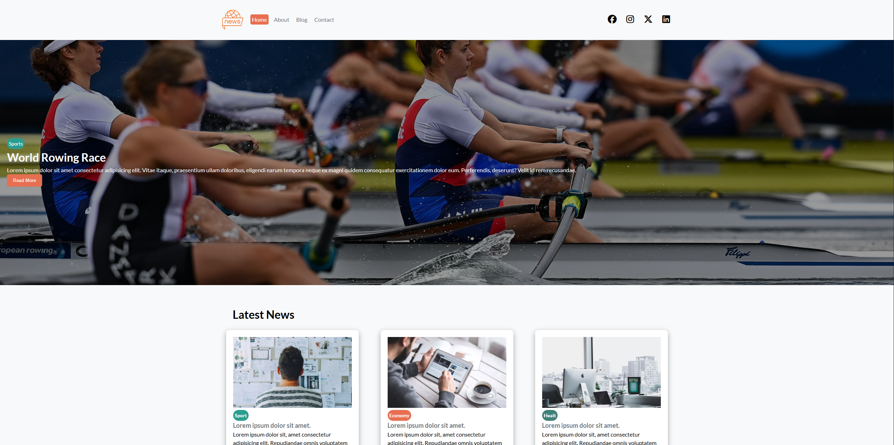
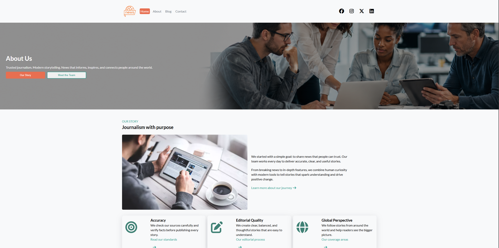
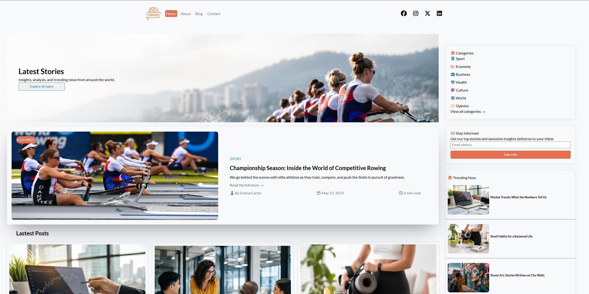
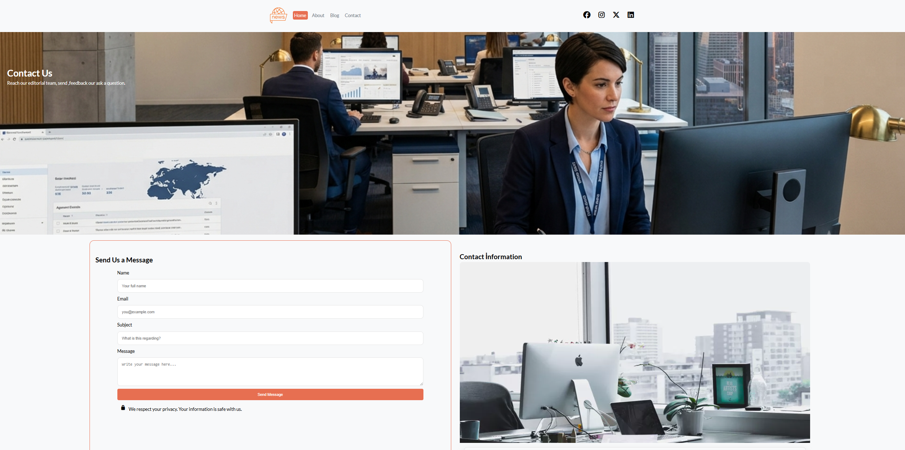

<div align="center">

# 📰 NewsSite

### Modern • Responsive • Multi-Page News Website

<p>
A modern and fully responsive news website built with pure HTML5 and CSS3.
</p>

<p>


</p>

</div>

---

# 🌍 Live Demo

## 🚀 Visit the Website

### 👉 https://muratefeergin.github.io/News-Site/

---

# 📸 Project Preview

## 🏠 Home



---

## 👥 About



---

## 📰 Blog



---

## 📞 Contact



---

# 📖 About The Project

NewsSite is a modern multi-page responsive website that simulates a professional online news platform.

The primary goal of this project is to strengthen front-end development skills by creating a clean, responsive, and user-friendly interface without using any CSS framework or JavaScript.

The project focuses on semantic HTML, responsive layouts, reusable CSS components, and modern UI design principles.

---

# ✨ Features

- ✅ Fully Responsive Design
- ✅ Modern User Interface
- ✅ Multi-Page Structure
- ✅ Semantic HTML5
- ✅ CSS Grid Layout
- ✅ Flexbox Layout
- ✅ CSS Variables
- ✅ Responsive Navigation
- ✅ Hero Section
- ✅ News Cards
- ✅ Blog Page
- ✅ About Page
- ✅ Contact Page
- ✅ Newsletter Form
- ✅ Font Awesome Icons
- ✅ Google Fonts
- ✅ Clean Folder Structure

---

# 🛠️ Technologies Used

<p align="center">


</p>

| Technology    | Description                   |
| ------------- | ----------------------------- |
| HTML5         | Semantic page structure       |
| CSS3          | Styling and responsive design |
| CSS Grid      | Two-dimensional layouts       |
| Flexbox       | Flexible layouts              |
| CSS Variables | Reusable color system         |
| Font Awesome  | Icons                         |
| Google Fonts  | Typography                    |
| VS Code       | Code editor                   |
| Git           | Version control               |
| GitHub        | Repository hosting            |

---

# 📂 Project Structure

```text
NewsSite
│
├── img/
│
├── screenshots/
│   ├── home.png
│   ├── about.png
│   ├── blog.png
│   └── contact.png
│
├── html/
│   ├── about.html
│   ├── blog.html
│   └── contact.html
│
├── style.css
├── responsive.css
├── index.html
└── README.md
```

---

# 📄 Website Pages

| Page       | Description                                             |
| ---------- | ------------------------------------------------------- |
| 🏠 Home    | Landing page featuring the latest news and hero section |
| 👥 About   | Company information, mission and editorial team         |
| 📰 Blog    | Featured articles and latest posts                      |
| 📞 Contact | Contact form and company information                    |

---

# 📱 Responsive Design

The website has been carefully optimized for different screen sizes.

| Device     | Status |
| ---------- | ------ |
| 📱 Mobile  | ✅     |
| 📲 Tablet  | ✅     |
| 💻 Laptop  | ✅     |
| 🖥 Desktop | ✅     |

---

# 🎨 UI Highlights

- Modern Color Palette
- Card-Based Layout
- Hero Banner
- Responsive Navigation
- CSS Grid
- Flexbox
- Hover Effects
- Clean Typography
- Consistent Spacing
- Reusable Components

---

# 🎯 Learning Objectives

This project helped me improve my knowledge of:

- Semantic HTML5
- CSS3
- Responsive Design
- CSS Grid
- Flexbox
- CSS Variables
- Mobile First Design
- Component-Based CSS
- Layout Design
- Clean Code Principles

---

# 🚀 Future Improvements

- 🔹 JavaScript Functionality
- 🔹 Dark Mode
- 🔹 Theme Switcher
- 🔹 Search Feature
- 🔹 News Filtering
- 🔹 Form Validation
- 🔹 API Integration
- 🔹 Animations
- 🔹 Backend Integration

---

# 👨‍💻 Developer

**Murat Efe Ergin**

GitHub

## https://github.com/muratEfeErgin

# ⭐ Support

If you enjoyed this project, consider giving it a ⭐ on GitHub.

It really helps and motivates me to build more projects.

---

---

<div align="center">

# 🇹🇷 Türkçe

</div>

# 📰 NewsSite

NewsSite, yalnızca **HTML5** ve **CSS3** kullanılarak geliştirilen modern ve tamamen responsive bir haber sitesi arayüzüdür.

Bu proje, gerçek bir haber platformunu örnek alarak hazırlanmış çok sayfalı bir front-end çalışmasıdır.

Temel amacı; modern web tasarım tekniklerini uygulamak, responsive geliştirme becerilerini artırmak ve temiz kod yazma alışkanlığı kazanmaktır.

---

# 🚀 Canlı Demo

### 👉 https://muratefeergin.github.io/News-Site/

---

# ✨ Özellikler

- ✅ Tamamen Responsive Tasarım
- ✅ Modern Arayüz
- ✅ Çok Sayfalı Yapı
- ✅ Semantic HTML5
- ✅ CSS Grid
- ✅ Flexbox
- ✅ CSS Variables
- ✅ Hero Alanı
- ✅ Blog Sayfası
- ✅ Hakkımızda Sayfası
- ✅ İletişim Sayfası
- ✅ Haber Kartları
- ✅ Font Awesome İkonları
- ✅ Google Fonts
- ✅ Düzenli Dosya Yapısı

---

# 🛠️ Kullanılan Teknolojiler

<p align="center">


</p>

- HTML5
- CSS3
- CSS Grid
- Flexbox
- CSS Variables
- Google Fonts
- Font Awesome
- Git
- GitHub
- Visual Studio Code

---

# 📂 Proje Yapısı

```text
NewsSite
│
├── img/
├── screenshots/
├── html/
├── style.css
├── responsive.css
├── index.html
└── README.md
```

---

# 📱 Responsive Tasarım

Proje aşağıdaki cihazlarda sorunsuz çalışacak şekilde geliştirilmiştir.

✅ Mobil

✅ Tablet

✅ Laptop

✅ Masaüstü

---

# 🎯 Bu Projede Öğrendiklerim

- Semantic HTML
- CSS Grid
- Flexbox
- Responsive Tasarım
- CSS Variables
- Modern Arayüz Tasarımı
- Component Mantığı
- Dosya Organizasyonu
- Temiz ve Okunabilir CSS Yazımı

---

# 🔮 Gelecekte Eklemeyi Planladıklarım

- JavaScript
- Dark Mode
- Haber Arama
- Haber Filtreleme
- API Entegrasyonu
- Animasyonlar
- Form Doğrulama
- Backend Desteği

---

# ❤️ Teşekkürler

Bu proje, front-end geliştirme becerilerimi geliştirmek amacıyla hazırlanmıştır.

Projeyi inceleyen herkese teşekkür ederim.

Eğer beğendiyseniz ⭐ vermeyi unutmayın.

---

<div align="center">

### ⭐ Thank you for visiting this repository!

Made with ❤️ by **Murat Efe Ergin**

</div>
